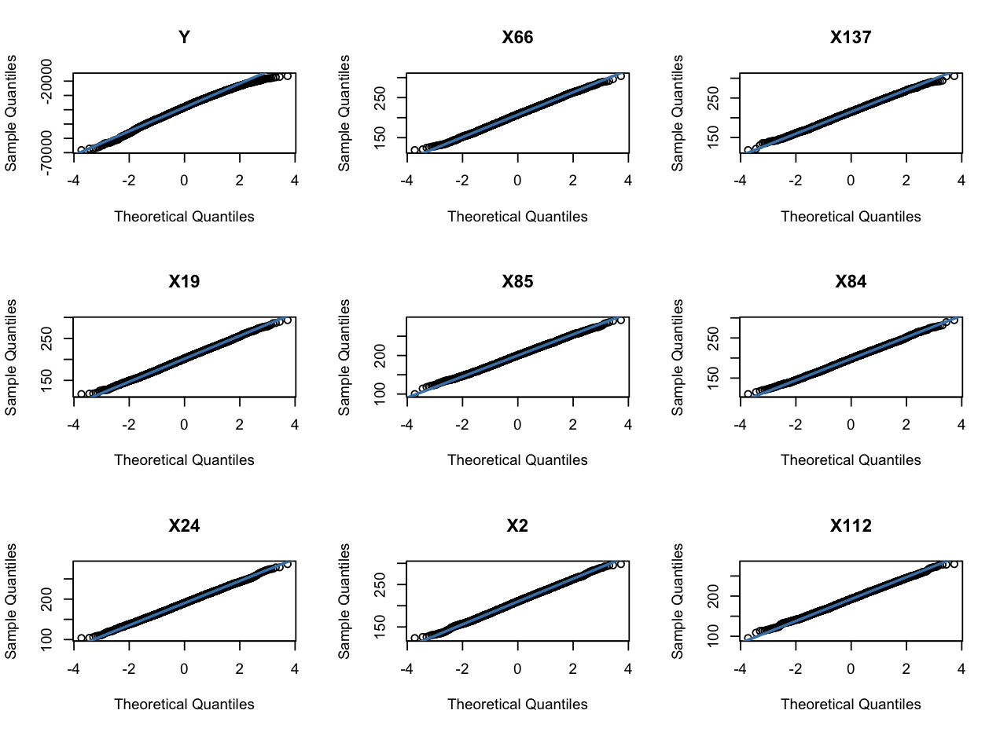
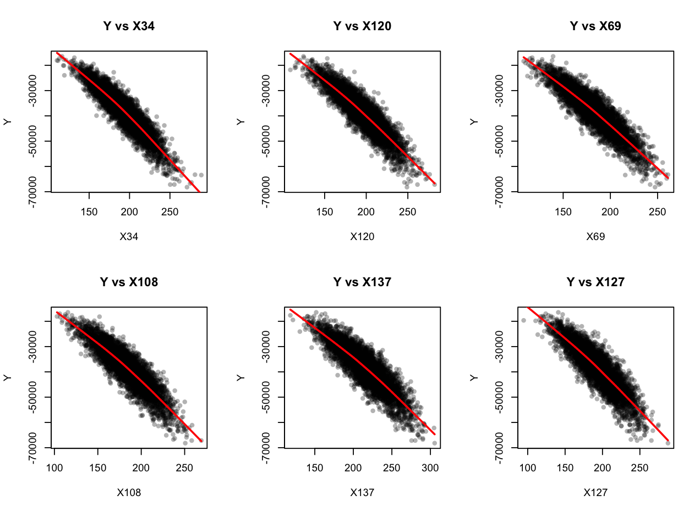
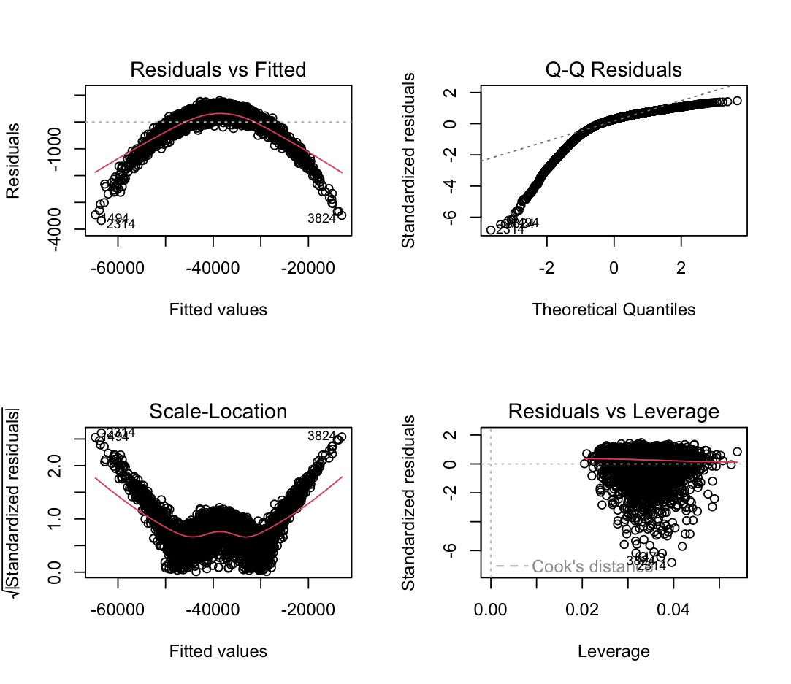
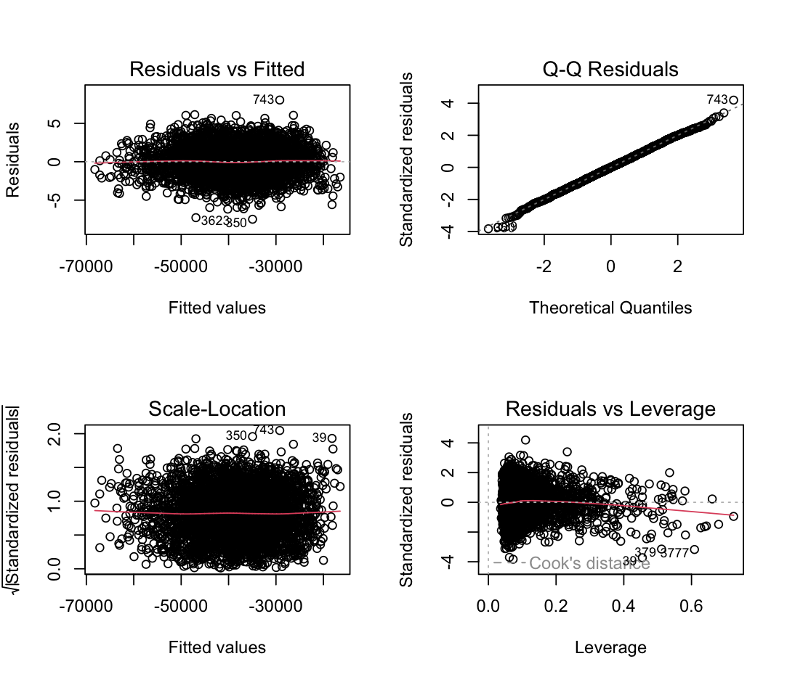

# High-Dimensional Predictive Modeling: Optimizing MSE for Robust Regression

## Description:
In the project, the task is to build a predictive model or algorithm of the response Y based on the predictors X1 through X140. There is no information available about the meaning of the data. After experminetation, EDA and modelling we find a final model that provides us with the lowest possible MSE.

## Dataset
Training Data:
- The training data contains 5200 samples and 141 columns.
- X1-X140 : Independent variables (predictors).
- Y: Dependent variable.

Test Data:
- The test data consists of another 5200 samples and 140 predictors.
- X1-X140: Independent variables (predictors).
- Test data does not have the Y column.

## Installation

### Prerequisites
- R >= 4.4.2
- RStudio (recommended)

### Clone git repository
```
git clone https://github.com/rahulkfernandes/High-Dim-Regression-MSE-Optimization.git
```

## Usage
For step by step analysis and modelling run every line of **main.R**.

For final predictions:
```
source ("Final.Predictions.R")
```

## Exploratory Data Analysis

The data was first loaded from the saved objects “Data.train.update.RData" and “Data.test.update.RData”. Preliminary exploration of the data showed no missing values in either dataset and that both datasets had 5200 rows and 140 independent variables. Only the train dataset had the dependent variable “Y”. Histograms for the top ten features with highest variances showed that the features are approximately normal. This was confirmed by plotting Q-Q plots for the same top features. The Q-Q plots showed that the data is normal with only the tails slightly deviating from the line.

#### Q-Q Plots:


A heat map of the correlation matrix showed that all features are highly multi-colinear and highly correlated with the dependent variable “Y”. Next, scatter plots with a Lowess smoother line between the top 6 features which have the highest correlation with “Y”, showed that there a common non-linear slight C - shaped relation.

#### Scatter Plots with LOWESS Smoother Lines:


## Modelling and Prediction
### Base Models
To get a benchmark MSE and to get a confirmation about the inferences from the EDA, four base models with default parameters were trained on a train partition and tested on a validation partition. Linear Regression MSE: 292898.5, Random Forest MSE: 2435901, SVM (Radial), MSE: 517048.3, 2nd Degree Polynomial Regression MSE: 45.33093.
Among the base models, the polynomial model outperformed all the other models, confirming the non-linear relationships.

### Experimenting with Models
Next, experimentation with different models showed that the 3rd degree polynomial function and Spline with 3 df performed similarly and outperformed other models or algorithms. Models Tested: Spline (3 df), Lasso Regression, Ridge Regression, 3rd Degree Polynomial Regression, GAM.

#### Linear Regression:


#### Polynomial Regression:


From the above plots, we can say that the 3rd degree polynomial fits better than the linear regression. For the polynomial model: (i) Residuals vs Fitted shows they are randomly scattered around zero, (ii) Q-Q Plot shows that they are normal, (iii) Scale-Location shows that the spread is relatively constant, (iv) Most points have low leverage and residuals near zero, suggesting that the polynomial model is more robust to outliers than the linear model. For the linear model, (i) Residuals vs Fitted shows a parabolic pattern indicating that the linear model fails to capture the non-linear relationship, (ii) Q-Q Plot shows that it violates the normality assumption, (iii) The Scale-Location indicates heteroscedasticity, (iv) Some points exhibit high leverage and large residuals, indicating that the linear model is sensitive to outliers.


### Cross-Validation
The Spline and Polynomial models were picked to further analyze and optimize with 10-fold cross validation with 3 rounds to find the best hyper-parameters.

- Polynomial:
    - Optimal degree: 3
    - Mean MSE for 3rd degree: 4.627994
- Spline:
    - Optimal degrees of freedom: 2
    - Mean MSE for 2df: 4.627994

### Final Modelling and Prediction
The 3rd Degree Polynomial was picked for the final Regression Model over the 2df Spline because it is a simpler model. Since scaling had no effect on the model, I chose to not apply scaling on the data. The Model is trained on the Data.train dataset and was used to make predictions on the Data.test dataset. The predictions on the test data are saved in the csv file called “Final.Predictions.csv”.

## Conculsion
The final predictions on a hold out test data setgave an MSE of 4.5. Which is also close to the MSE on our validation set, showing that the model is not overfitting and we have found the best possible model for this project.